# Money Manager Architecture - PlantUML Documentation

## Table of Contents
1. [Overview](#overview)
2. [System Architecture](#system-architecture)
3. [Component Diagram](#component-diagram)
4. [Domain Model (Class Diagram)](#domain-model-class-diagram)
5. [Database Schema](#database-schema)
6. [Sequence Diagrams](#sequence-diagrams)
7. [Design Patterns](#design-patterns)
8. [Technology Stack](#technology-stack)

---

## Overview

**finGest-rs** is a RESTful API for personal money management built with Rust, using the Actix-Web framework and PostgreSQL database. The application follows a layered architecture pattern with clear separation of concerns across API, Service, and Data layers.

### Key Features
- **Authentication & Authorization** - JWT-based stateless authentication with bcrypt password hashing
- User account management
- Wallet management with multi-currency support
- Expense tracking with categorization
- Budget planning and monitoring
- Savings goals tracking
- Financial summaries and reporting

---

## System Architecture

### High-Level Component Architecture

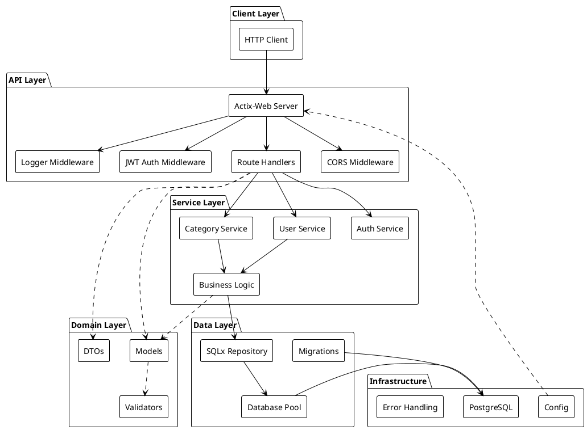

---

## Component Diagram

### Detailed Component Structure

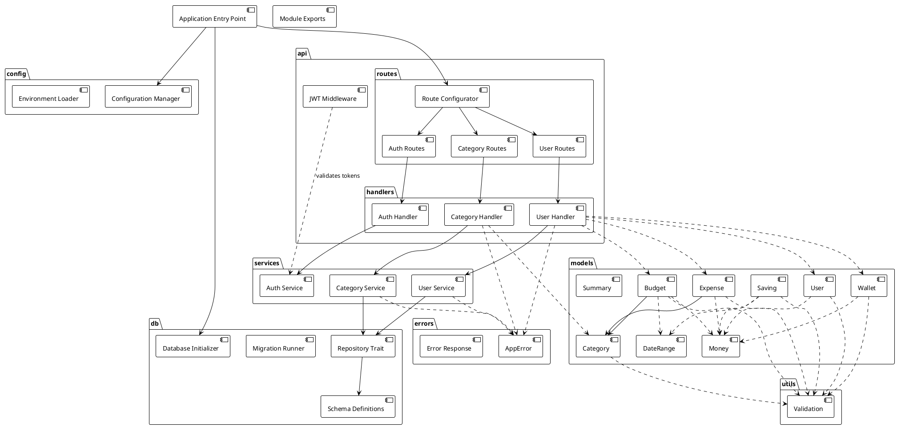

---

## Domain Model (Class Diagram)

### Core Domain Entities

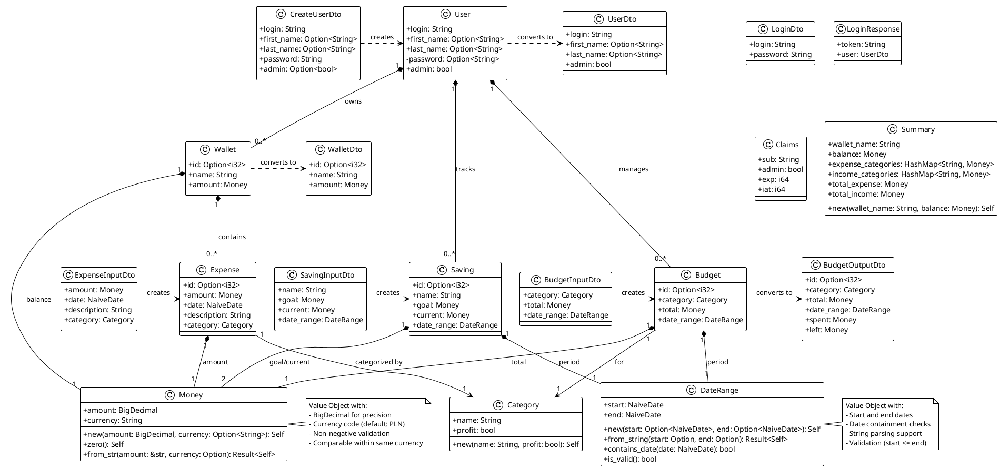

---

## Database Schema

### Entity-Relationship Diagram

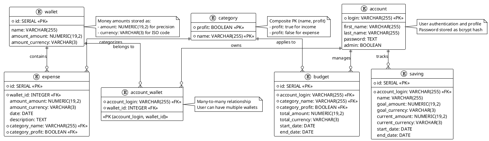

---

## Sequence Diagrams

### 1. User Authentication Flow

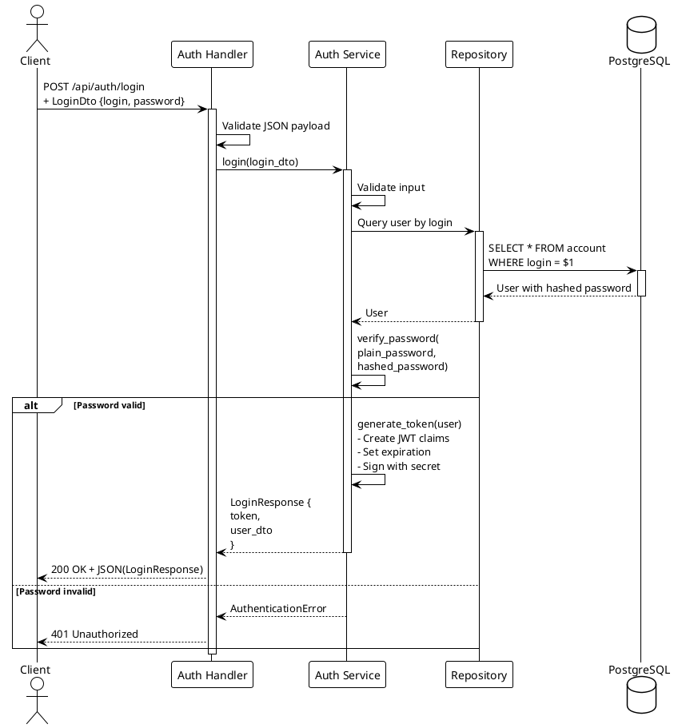

### 2. Protected Endpoint with JWT Middleware

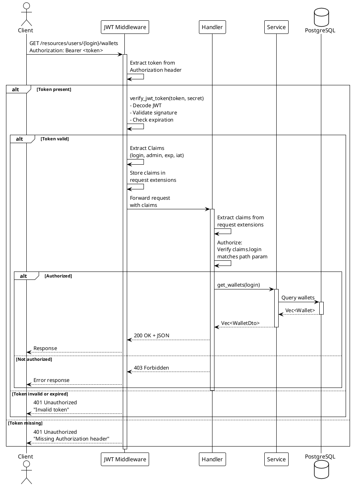

### 3. User Registration Flow

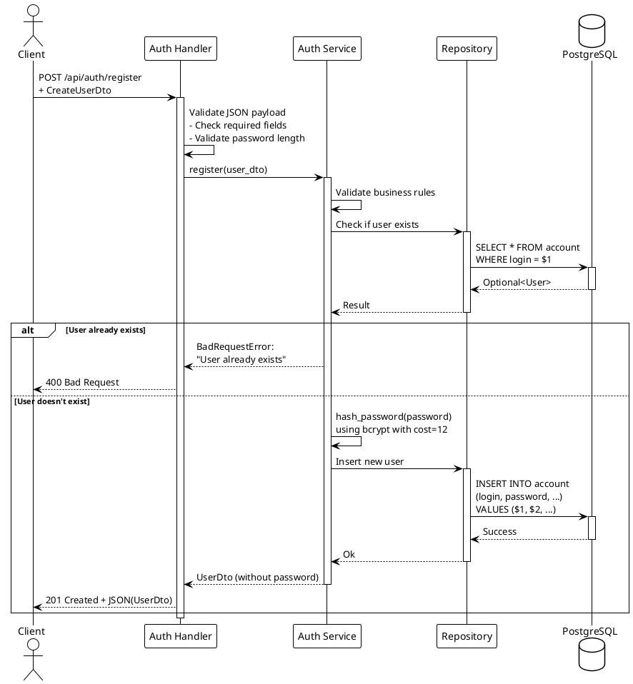

### 4. Get Wallet Summary

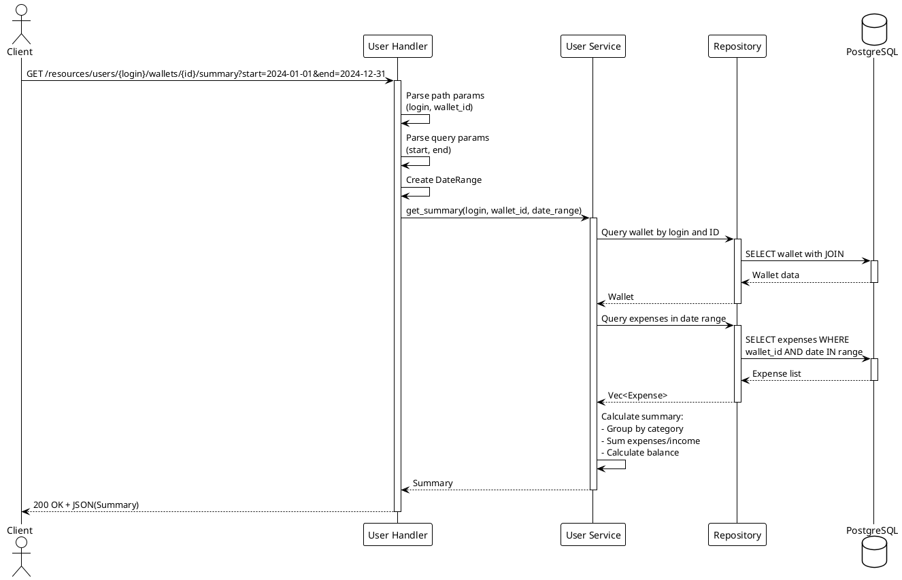

### 5. Create Expense Flow

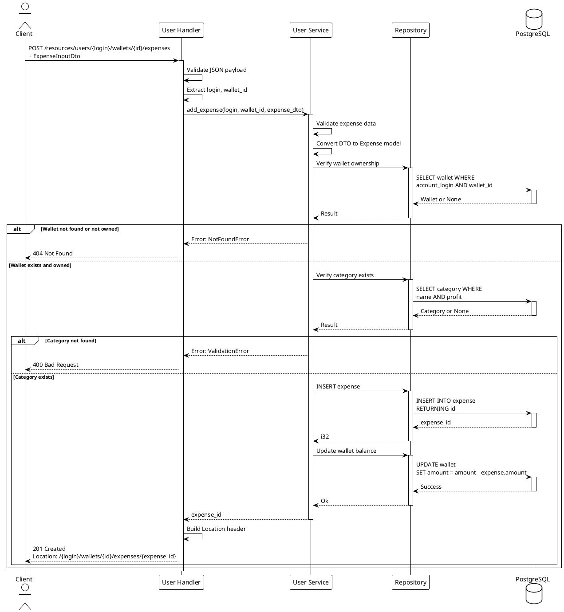

### 3. User Authentication Flow


### 4. Protected Endpoint with JWT Middleware


### 5. User Registration Flow


### 6. Get All Categories

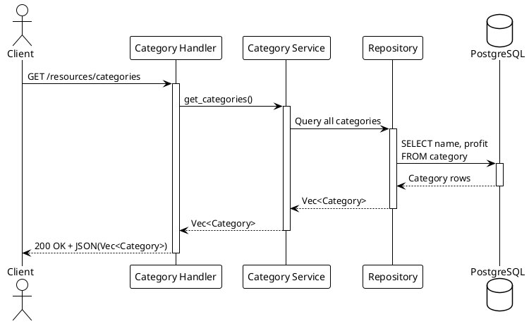

### 7. Application Startup

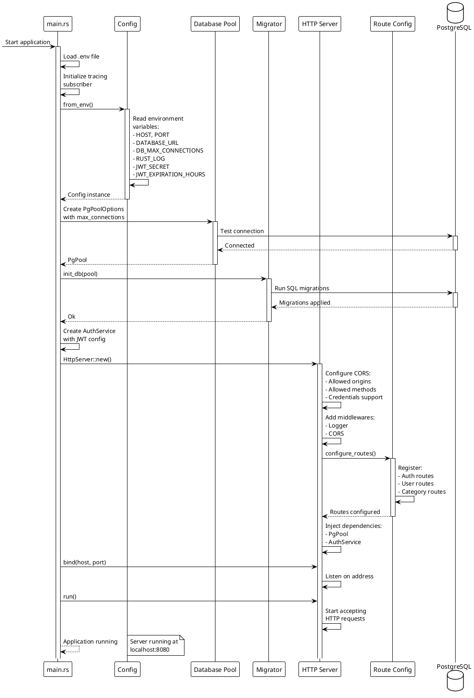

---

## Design Patterns

### 1. **Layered Architecture Pattern**
The application follows a strict three-tier architecture:

- **Presentation Layer (API)**: `handlers/`, `routes/`, and `middleware/`
  - Handles HTTP requests/responses
  - Request validation and parameter extraction
  - Response formatting and status codes
  - JWT authentication middleware for protected routes

- **Business Logic Layer (Services)**: `services/`
  - Encapsulates business rules
  - Orchestrates data operations
  - Independent of HTTP concerns
  - Authentication and authorization logic

- **Data Access Layer (Repository)**: `db/`
  - Database interactions via SQLx
  - Query execution and result mapping
  - Connection pool management

### 2. **Data Transfer Object (DTO) Pattern**
Separates internal domain models from external API contracts:
- `UserDto`, `CreateUserDto` for API communication
- `ExpenseInputDto` for request payloads
- `BudgetOutputDto` for enriched responses
- Conversions via `From` trait implementations

### 3. **Repository Pattern**
Generic `Repository<T, ID>` trait defines CRUD operations:
```rust
pub trait Repository<T, ID> {
    async fn find_all(&self) -> Result<Vec<T>, AppError>;
    async fn find_by_id(&self, id: ID) -> Result<Option<T>, AppError>;
    async fn create(&self, item: T) -> Result<T, AppError>;
    async fn update(&self, id: ID, item: T) -> Result<T, AppError>;
    async fn delete(&self, id: ID) -> Result<(), AppError>;
}
```

### 4. **Service Trait Pattern**
Business logic defined through traits for testability:
- `AuthServiceTrait` - Authentication, JWT generation/validation, password hashing
- `UserServiceTrait` - User and wallet operations
- `CategoryServiceTrait` - Category management
- Enables mock implementations for testing (MockAuthService, etc.)

### 5. **Value Object Pattern**
Immutable, validated domain objects:
- **Money**: Encapsulates amount + currency with validation
- **DateRange**: Encapsulates period with validity checks
- Implements `PartialEq`, `PartialOrd` where applicable

### 6. **Error Handling Pattern**
Centralized error management with `AppError` enum:
- Custom error types for different scenarios
- Implements `ResponseError` trait for HTTP mapping
- Uses `thiserror` for ergonomic error definitions

### 7. **Dependency Injection Pattern**
Runtime dependencies injected via Actix-Web's `Data<T>`:
```rust
App::new()
    .app_data(web::Data::new(pool.clone()))
    .configure(configure_routes)
```
Handlers receive `web::Data<PgPool>` as parameter

### 8. **Builder Pattern**
Configuration and pool construction:
```rust
PgPoolOptions::new()
    .max_connections(config.db_max_connections)
    .connect(&config.db_url)
    .await

AuthService::new(pool, jwt_secret)
    .with_expiration(24)
```

### 9. **Middleware Pattern**
Actix-Web middleware for cross-cutting concerns:
- **JwtAuth Middleware**: Intercepts requests, validates JWT tokens, injects claims into request context
- Implements `Transform` and `Service` traits
- Enables declarative authentication on routes

---

## Technology Stack

### Core Framework & Runtime
- **Actix-Web 4.3**: High-performance async web framework
- **Tokio 1.29**: Async runtime with full feature set

### Database
- **SQLx 0.7**: Compile-time checked SQL queries
  - Runtime: tokio-rustls
  - Database: PostgreSQL
  - Features: time, uuid, bigdecimal, macros, json, migrate
- **PostgreSQL**: Relational database

### Serialization & Validation
- **Serde 1.0**: Serialization/deserialization framework
- **Serde JSON 1.0**: JSON support
- **Validator 0.16**: Derive-based validation

### Authentication & Security
- **jsonwebtoken 9.2**: JWT token generation and validation
- **bcrypt 0.15**: Password hashing with configurable cost
- **async-trait 0.1**: Async trait support for service abstractions

### Data Types
- **BigDecimal 0.3**: Arbitrary precision decimals for money
- **Chrono 0.4**: Date and time handling
- **UUID 1.4**: Unique identifier generation

### Error Handling & Logging
- **thiserror 1.0**: Custom error type derivation
- **Tracing 0.1** + **tracing-subscriber 0.3**: Structured logging
- **env_logger 0.10**: Environment-based log configuration

### Middleware & Cross-Cutting
- **actix-cors 0.6**: CORS middleware
- **dotenv 0.15**: Environment variable loading

### Development & Testing
- **mockall 0.11**: Mock object generation for traits
- **tokio-test 0.4**: Testing utilities
- **actix-rt 2.8**: Actix runtime for tests
- **fake 2.6**: Fake data generation for tests

### Build & Configuration
- **Custom build.rs**: Build-time configuration
- **SQLx offline mode**: Compile-time query verification via `sqlx-data.json`

---

## Architecture Characteristics

### 1. **Async/Await Everywhere**
All I/O operations are asynchronous using Rust's async/await syntax, powered by Tokio runtime.

### 2. **Type Safety**
- Strong typing with Rust's type system
- Compile-time SQL query verification via SQLx macros
- Validation at model boundaries via `validator` crate

### 3. **Separation of Concerns**
Clear boundaries between:
- HTTP handling (handlers)
- Business logic (services)
- Data persistence (repositories)
- Domain modeling (models)

### 4. **Testability**
- Trait-based service interfaces enable mocking
- DTOs allow testing without database
- Repository pattern isolates data access

### 5. **Scalability**
- Connection pooling for efficient resource usage
- Async I/O for high concurrency
- Stateless API design

### 6. **Security**
- **JWT-based authentication** with HS256 algorithm
- **bcrypt password hashing** with cost factor 12
- **Token expiration** with configurable duration (default: 24 hours)
- Password fields excluded from serialization
- **Authorization middleware** for protected endpoints
- CORS configuration for cross-origin requests with credentials support
- Database transactions for data consistency
- **Input validation** at API boundary using validator crate

### 7. **Maintainability**
- Modular structure with clear module boundaries
- Consistent error handling across layers
- Type-driven development with strong contracts

---

## Data Flow Example

**User authentication:**

1. **Client** sends POST request to `/api/auth/login` with credentials
2. **Route** matches and calls `login` handler
3. **Handler** validates JSON body, calls AuthService
4. **AuthService** queries database for user
5. **AuthService** verifies password using bcrypt
6. **AuthService** generates JWT token with user claims
7. **Handler** returns 200 OK with token and user data
8. **Client** stores token for subsequent requests

**Creating an expense (protected endpoint):**

1. **Client** sends POST request to `/resources/users/{login}/wallets/{id}/expenses` with JWT token
2. **JWT Middleware** intercepts request, validates token, injects claims
3. **Route** matches and calls `create_expense` handler
4. **Handler** extracts claims, verifies authorization, validates JSON body
5. **Service** receives `ExpenseInputDto`, validates business rules
6. **Repository** executes INSERT query via SQLx
7. **Database** returns new expense ID
8. **Service** updates wallet balance (transaction)
9. **Handler** returns 201 Created with Location header
10. **Client** receives response

---

## Summary

This architecture demonstrates:
- **Clean separation of concerns** with layered architecture
- **Stateless JWT authentication** with bcrypt password hashing
- **Security-first design** with middleware-based authorization
- **Type-safe database interactions** via SQLx
- **Robust error handling** with custom error types
- **High performance** through async/await and connection pooling
- **Maintainability** through trait abstractions and DTOs
- **Domain-driven design** with value objects (Money, DateRange)
- **RESTful API design** following HTTP semantics
- **Testability** with comprehensive mocking support

The PlantUML diagrams above can be rendered using any PlantUML-compatible tool (e.g., PlantUML online server, VS Code extensions, or standalone PlantUML jar) to visualize the architecture.

---

## Complete Architecture Class Diagram

### Comprehensive System View

```plantuml
@startuml Money Manager - Complete Architecture
!theme plain
skinparam classAttributeIconSize 0

' ===== API LAYER =====
package "API Layer" #F3E5F5 {
    class AuthHandler {
        +register(auth_service, user_dto): Result<HttpResponse>
        +login(auth_service, login_dto): Result<HttpResponse>
        +verify_token(auth_service, req): Result<HttpResponse>
    }
    
    class CategoryHandler {
        +get_categories(pool: Data<PgPool>): Result<HttpResponse>
    }
    
    class UserHandler {
        +get_users(pool: Data<PgPool>): Result<HttpResponse>
        +update_user(pool, path, query, body): Result<HttpResponse>
        +get_wallets(pool, path): Result<HttpResponse>
        +create_wallet(pool, path, wallet): Result<HttpResponse>
        +get_summary(pool, path, query): Result<HttpResponse>
        +get_expenses(pool, path, query): Result<HttpResponse>
        +get_highest_expense(pool, path, query): Result<HttpResponse>
        +create_expense(pool, path, expense): Result<HttpResponse>
        +delete_expense(pool, path): Result<HttpResponse>
        +get_counted_categories(pool, path, query): Result<HttpResponse>
        +get_budgets(pool, path, query): Result<HttpResponse>
        +create_budget(pool, path, budget): Result<HttpResponse>
    }
    
    class AuthRoutes {
        +auth_routes(cfg: ServiceConfig)
    }
    
    class CategoryRoutes {
        +category_routes(cfg: ServiceConfig)
    }
    
    class UserRoutes {
        +user_routes(cfg: ServiceConfig)
    }
    
    class RouteConfigurator {
        +configure_routes(cfg: ServiceConfig)
    }
    
    class JwtAuthMiddleware {
        -jwt_secret: String
        +new(jwt_secret: String): Self
        +call(req: ServiceRequest): Future
        -verify_jwt_token(token, secret): Result<Claims>
    }
    
    class MiddlewareHelper {
        +get_claims_from_request(req): Option<Claims>
    }
}

' ===== SERVICE LAYER =====
package "Service Layer" #FFF3E0 {
    interface AuthServiceTrait {
        +register(user_dto: CreateUserDto): Result<UserDto>
        +login(login_dto: LoginDto): Result<LoginResponse>
        +verify_token(token: &str): Result<Claims>
        +generate_token(user: &User): Result<String>
        +hash_password(password: &str): Result<String>
        +verify_password(password: &str, hash: &str): Result<bool>
    }
    
    class AuthService {
        -pool: PgPool
        -jwt_secret: String
        -jwt_expiration_hours: i64
        +new(pool: PgPool, jwt_secret: String): Self
        +with_expiration(hours: i64): Self
        +register(user_dto: CreateUserDto): Result<UserDto>
        +login(login_dto: LoginDto): Result<LoginResponse>
        +verify_token(token: &str): Result<Claims>
        +generate_token(user: &User): Result<String>
        +hash_password(password: &str): Result<String>
        +verify_password(password: &str, hash: &str): Result<bool>
    }
    
    interface CategoryServiceTrait {
        +get_categories(): Result<Vec<Category>>
    }
    
    class CategoryService {
        -pool: PgPool
        +new(pool: PgPool): Self
        +get_categories(): Result<Vec<Category>>
    }
    
    interface UserServiceTrait {
        +get_users(): Result<Vec<UserDto>>
        +update_user(login, field, value): Result<()>
        +get_wallets(login): Result<Vec<WalletDto>>
        +add_wallet(login, wallet): Result<i32>
        +get_summary(login, wallet_id, date_range): Result<Summary>
        +get_expenses(login, wallet_id, date_range): Result<Vec<Expense>>
        +get_highest_expense(login, wallet_id, date_range): Result<Option<Expense>>
        +add_expense(login, wallet_id, expense): Result<i32>
        +delete_expense(login, wallet_id, expense_id): Result<()>
        +get_counted_categories(login, wallet_id, date_range): Result<HashMap<String, BigDecimal>>
        +get_budgets(login, start, end): Result<Vec<BudgetOutputDto>>
        +add_budget(login, budget): Result<i32>
    }
    
    class UserService {
        -pool: PgPool
        +new(pool: PgPool): Self
        +get_users(): Result<Vec<UserDto>>
        +update_user(login, field, value): Result<()>
        +get_wallets(login): Result<Vec<WalletDto>>
        +add_wallet(login, wallet): Result<i32>
        +get_summary(login, wallet_id, date_range): Result<Summary>
        +get_expenses(login, wallet_id, date_range): Result<Vec<Expense>>
        +get_highest_expense(login, wallet_id, date_range): Result<Option<Expense>>
        +add_expense(login, wallet_id, expense): Result<i32>
        +delete_expense(login, wallet_id, expense_id): Result<()>
        +get_counted_categories(login, wallet_id, date_range): Result<HashMap<String, BigDecimal>>
        +get_budgets(login, start, end): Result<Vec<BudgetOutputDto>>
        +add_budget(login, budget): Result<i32>
    }
}

' ===== DOMAIN MODELS =====
package "Domain Models" #FFEBEE {
    class User {
        +login: String
        +first_name: Option<String>
        +last_name: Option<String>
        -password: Option<String>
        +admin: bool
    }
    
    class UserDto {
        +login: String
        +first_name: Option<String>
        +last_name: Option<String>
        +admin: bool
    }
    
    class CreateUserDto {
        +login: String
        +first_name: Option<String>
        +last_name: Option<String>
        +password: String
        +admin: Option<bool>
    }
    
    class LoginDto {
        +login: String
        +password: String
    }
    
    class LoginResponse {
        +token: String
        +user: UserDto
    }
    
    class Claims {
        +sub: String
        +admin: bool
        +exp: i64
        +iat: i64
    }
    
    class Category {
        +name: String
        +profit: bool
        +new(name, profit): Self
    }
    
    class Wallet {
        +id: Option<i32>
        +name: String
        +amount: Money
    }
    
    class WalletDto {
        +id: Option<i32>
        +name: String
        +amount: Money
    }
    
    class Expense {
        +id: Option<i32>
        +amount: Money
        +date: NaiveDate
        +description: String
        +category: Category
    }
    
    class ExpenseInputDto {
        +amount: Money
        +date: NaiveDate
        +description: String
        +category: Category
    }
    
    class Budget {
        +id: Option<i32>
        +category: Category
        +total: Money
        +date_range: DateRange
    }
    
    class BudgetInputDto {
        +category: Category
        +total: Money
        +date_range: DateRange
    }
    
    class BudgetOutputDto {
        +id: Option<i32>
        +category: Category
        +total: Money
        +date_range: DateRange
        +spent: Money
        +left: Money
    }
    
    class Saving {
        +id: Option<i32>
        +name: String
        +goal: Money
        +current: Money
        +date_range: DateRange
    }
    
    class SavingInputDto {
        +name: String
        +goal: Money
        +current: Money
        +date_range: DateRange
    }
    
    class Money {
        +amount: BigDecimal
        +currency: String
        +new(amount, currency): Self
        +zero(): Self
        +from_str(amount, currency): Result<Self>
    }
    
    class DateRange {
        +start: NaiveDate
        +end: NaiveDate
        +new(start, end): Self
        +from_string(start, end): Result<Self>
        +contains_date(date): bool
        +is_valid(): bool
    }
    
    class Summary {
        +wallet_name: String
        +balance: Money
        +expense_categories: HashMap<String, Money>
        +income_categories: HashMap<String, Money>
        +total_expense: Money
        +total_income: Money
        +new(wallet_name, balance): Self
    }
}

' ===== DATABASE LAYER =====
package "Database Layer" #E8F5E9 {
    class DatabaseInitializer {
        +init_db(pool: PgPool): Result<()>
    }
    
    class MigrationRunner {
        +run(pool: PgPool): Result<()>
        +create_database_if_not_exists(url): Result<()>
    }
    
    interface Repository<T, ID> {
        +find_all(): Result<Vec<T>>
        +find_by_id(id: ID): Result<Option<T>>
        +create(item: T): Result<T>
        +update(id: ID, item: T): Result<T>
        +delete(id: ID): Result<()>
    }
}

' ===== ERROR HANDLING =====
package "Error Handling" #FFCDD2 {
    class AppError <<enum>> {
        AuthenticationError(String)
        AuthorizationError(String)
        DatabaseError(String)
        NotFoundError(String)
        ValidationError(String)
        BadRequestError(String)
        InternalServerError(String)
        +error_response(): HttpResponse
    }
    
    class ErrorResponse {
        +status: String
        +message: String
    }
}

' ===== CONFIGURATION =====
package "Configuration" #FCE4EC {
    class Config {
        +host: String
        +port: u16
        +db_url: String
        +db_max_connections: u32
        +log_level: String
        +jwt_secret: String
        +jwt_expiration_hours: i64
        +from_env(): Result<Self>
    }
    
    class ConfigError <<enum>> {
        MissingEnv(String)
        InvalidEnv(String)
    }
}

' ===== UTILITIES =====
package "Utilities" #E0F2F1 {
    class Validation {
        +validate_non_negative(amount): Result<()>
    }
}

' ===== RELATIONSHIPS =====

' API to Services
AuthHandler ..> AuthService : uses
CategoryHandler ..> CategoryService : uses
UserHandler ..> UserService : uses
AuthRoutes --> AuthHandler
CategoryRoutes --> CategoryHandler
UserRoutes --> UserHandler
RouteConfigurator --> AuthRoutes
RouteConfigurator --> CategoryRoutes
RouteConfigurator --> UserRoutes
JwtAuthMiddleware ..> AuthService : validates tokens
UserHandler ..> MiddlewareHelper : extracts claims

' Service implementations
AuthService ..|> AuthServiceTrait : implements
CategoryService ..|> CategoryServiceTrait : implements
UserService ..|> UserServiceTrait : implements

' Services to Models
AuthService ..> User : uses
AuthService ..> UserDto : uses
AuthService ..> CreateUserDto : uses
AuthService ..> LoginDto : uses
AuthService ..> LoginResponse : uses
AuthService ..> Claims : uses
AuthService ..> AppError : throws
CategoryService ..> Category : uses
CategoryService ..> AppError : throws
UserService ..> User : uses
UserService ..> UserDto : uses
UserService ..> Wallet : uses
UserService ..> WalletDto : uses
UserService ..> Expense : uses
UserService ..> Budget : uses
UserService ..> BudgetOutputDto : uses
UserService ..> Summary : uses
UserService ..> DateRange : uses
UserService ..> AppError : throws

' Handlers to Models
AuthHandler ..> CreateUserDto : uses
AuthHandler ..> LoginDto : uses
AuthHandler ..> LoginResponse : uses
AuthHandler ..> Claims : uses
AuthHandler ..> AppError : throws
CategoryHandler ..> Category : uses
CategoryHandler ..> AppError : throws
UserHandler ..> UserDto : uses
UserHandler ..> WalletDto : uses
UserHandler ..> ExpenseInputDto : uses
UserHandler ..> BudgetInputDto : uses
UserHandler ..> Summary : uses
UserHandler ..> DateRange : uses
UserHandler ..> AppError : throws

' Domain Model Relationships
User "1" *-- "0..*" Wallet : owns
User "1" *-- "0..*" Budget : manages
User "1" *-- "0..*" Saving : tracks
Wallet "1" *-- "0..*" Expense : contains
Expense "1" --> "1" Category : categorized by
Expense "1" *-- "1" Money : amount
Budget "1" --> "1" Category : for
Budget "1" *-- "1" Money : total
Budget "1" *-- "1" DateRange : period
Saving "1" *-- "2" Money : goal/current
Saving "1" *-- "1" DateRange : period
Wallet "1" *-- "1" Money : balance
Summary "1" *-- "1" Money : balance
Summary "1" *-- "3" Money : balance, total_expense, total_income
' DTO Conversions
User .> UserDto : converts to
CreateUserDto .> User : creates
LoginDto ..> LoginResponse : produces
LoginResponse *-- UserDto : contains
LoginResponse *-- Claims : generates via JWT
Wallet .> WalletDto : converts to
ExpenseInputDto .> Expense : creates
BudgetInputDto .> Budget : creates
Budget .> BudgetOutputDto : converts to
SavingInputDto .> Saving : creates

' Validation
User ..> Validation : validates
Wallet ..> Validation : validates
Expense ..> Validation : validates
Budget ..> Validation : validates
Saving ..> Validation : validates
Category ..> Validation : validates
Money ..> Validation : validates
DateRange ..> Validation : validates

' Database
AuthService ..> Repository : uses
UserService ..> Repository : uses
CategoryService ..> Repository : uses
DatabaseInitializer --> MigrationRunner : uses

' Configuration
Config ..> ConfigError : may throw

note right of Money
  Value Object with:
  - BigDecimal for precision
  - Currency code (PLN default)
  - Non-negative validation
  - Currency-aware comparisons
end note

note right of DateRange
  Value Object with:
  - Start and end dates
  - Date containment checks
  - String parsing support
  - Range validation
end note

note right of AppError
  Centralized error handling:
  - Implements ResponseError
  - Maps to HTTP status codes
  - Consistent error responses
end note

note right of Repository
  Generic repository pattern:
  - Type-safe CRUD operations
  - Async trait methods
  - Database abstraction
end note

@enduml
```